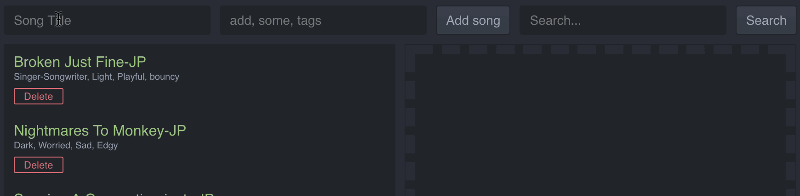
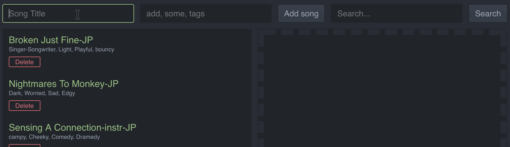
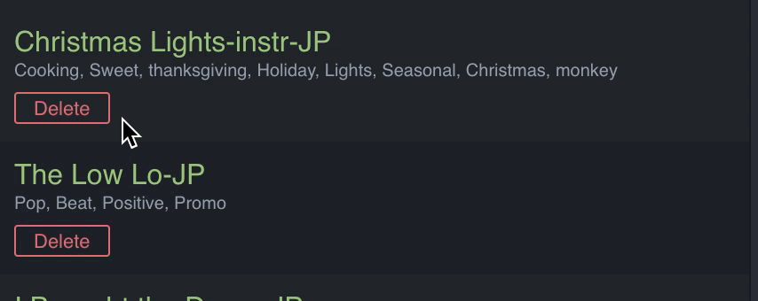

# Song Tagger

A basic song title and tagging crud interface with drag-and-drop and export capabilities built with Ruby on Rails and React.

-----
### To run locally

Install dependences:
```bash
$ bundle && cd client && npm i && cd ..
```

Create and seed database:
```bash
$ rake db:create && rake db:seed
```

Run local Rails and React server on `http://localhost:3000/`
```bash
$ rake start
```
-----


### Drag and drop into export list
When at least one song is in export list, Export button appears allowing for export of csv file.


### Create and Delete songs and tags
Songs cannot be created without at least one tag.  If tag does not already exist in database, a new one will be created. If tag attached to deleted song is not associated with any other songs in the database, the tag will also be deleted.

Tags with less than 3 characters in the name will be invalid.  Songs with less than 3 characters in the title, or without at least one valid tag will not be created or updated.  


Songs and/or tags with duplicate names cannot be created.



Songs and/or tags with special characters names cannot be created.



### Edit song title and/or tag name
Double clicking on song item opens up edit mode allowing for editing of song title and CRUD options for tags.  




### Search by song title and/or tag name
When search query is empty, all songs are automatically loaded.


### Responsive Design


### In the future
Refactoring of css implementation to use `styled-components` instead of inline component styles mixed with stylesheets.
